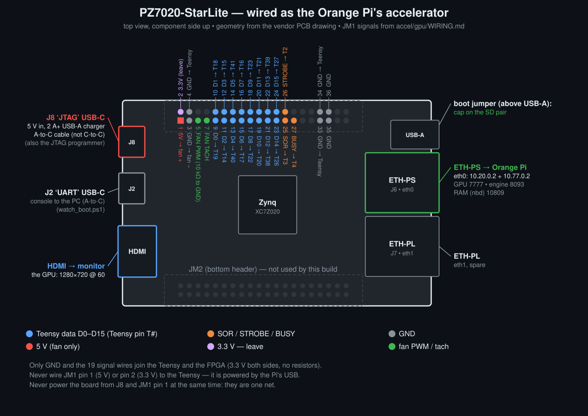

# Wiring: Orange Pi 4 Pro + PZ7020 FPGA + Teensy 4.1

Diagram: [hardware/pz7020-starlite/accel-wiring.svg](../../hardware/pz7020-starlite/accel-wiring.svg) (vendor PCB geometry; regenerate with `tools/make_accel_wiring_svg.py`). The upper Ethernet jack is **ETH-PS** (J6, the Pi's link), the lower **ETH-PL** (J7); the upper USB-C is **J8 JTAG** (power), the lower **J2 UART** (console) -- from the vendor schematic and the manual's board photo.

## What plugs into what

| From | To | Cable |
|---|---|---|
| Orange Pi **Ethernet** port | FPGA **upper** Ethernet jack, silkscreen `ETH-PS` (J6) | normal Ethernet cable |
| Orange Pi **USB-A** port | Teensy **micro-USB** | USB **data** cable (not charge-only) |
| Teensy pins | FPGA header **JM1** | 19 signal jumpers + 4 ground jumpers (table below) |
| FPGA **HDMI** | a monitor / TV | HDMI cable: this is the GPU's screen |
| 5 V **USB-A** charger, **2 A or more** | FPGA **upper** Type-C, silkscreen `JTAG` (J8) | **USB-A to USB-C** cable: powers the FPGA |
| Orange Pi's own supply | Orange Pi | as you use it now |

- The FPGA's USB-C ports have no CC resistors (vendor schematic sheets 9 and 19), so a USB-C to USB-C cable or a USB-C-only charger gives the board **no power**. Use a USB-A charger and an A-to-C cable.
- Why 2 A: the board is rated 5 V / 1 A, and a fan on JM1 pin 1 draws from the same 5 V.
- The FPGA boot jumper goes on **SD**, with the SD card in the FPGA's slot (underside).
- The Teensy gets its power from the Orange Pi over USB. Never connect Teensy VIN or 3.3V to the FPGA, and never connect FPGA JM1 pin 1 (5 V) or pin 2 (3.3 V) to the Teensy. **Only ground and the signal wires connect the two boards.**
- Don't power the FPGA from its Type-C and its header 5 V pin at the same time. Those two are hard-wired together.

## Teensy 4.1 to FPGA JM1 (19 signals)

The FPGA side is 3.3 V and the Teensy is 3.3 V, so the wires go direct with no resistors or level shifters.

| JM1 pin | FPGA ball | Signal | Teensy pin |
|:---:|:---:|:---|:---:|
| 9  | E18 | D0  | 19 |
| 10 | F16 | D1  | 18 |
| 11 | E19 | D2  | 14 |
| 12 | F17 | D3  | 15 |
| 13 | G17 | D4  | 40 |
| 14 | B19 | D5  | 41 |
| 15 | G18 | D6  | 17 |
| 16 | A20 | D7  | 16 |
| 17 | D19 | D8  | 22 |
| 18 | C20 | D9  | 23 |
| 19 | D20 | D10 | 20 |
| 20 | B20 | D11 | 21 |
| 21 | J18 | D12 | 38 |
| 22 | K19 | D13 | 39 |
| 23 | H18 | D14 | 26 |
| 24 | J19 | D15 | 27 |
| 25 | K17 | SOR (start of record) | 3 |
| 26 | M17 | STROBE | 2 |
| 27 | K18 | BUSY (FPGA to Teensy) | 4 |
| **4, 33, 34, 35** | GND | **ground: use all four** | any **GND** pins on the Teensy |

Tips:
- Keep the jumpers **20 cm or shorter**, and run the ground wires alongside the bundle rather than off to one side.
- JM1 pins 1, 3, 5 and 7 are left free on purpose; your fan uses them (5 V, GND, PWM, tach). Pin 3 is the fan's GND, not a Teensy ground. Pin 36 is a spare GND.
- The 40-pin headers can come unpopulated from the factory. If JM1 has bare holes, solder a 2x20 header first.

### Finding JM1 and its pin 1

Turn the FPGA board so the **Ethernet jacks are on the right** and the **USB-C ports are on the left**:
- **JM1 is the header along the top edge.** JM2 is along the bottom edge.
- **JM1 pin 1 is the square pad at the left end of the inner row** (the row nearer the middle of the board).
  The odd pins (1, 3, 5 ... 39) run left to right along the inner row. The even pins (2, 4, 6 ... 40) run along the outer row, with pin 2 next to pin 1.
- Your board repo has a printable sheet showing every pin: `D:\pz7020-starlite\docs\PZ7020-StarLite-pinout-sheet.pdf`.

Fit the wires in this order:
1. With no Teensy wires on JM1, power the FPGA from J8 and check with a meter: pin 1 reads 5 V and pin 2 reads 3.3 V to pin 3 (GND).
2. Unplug the FPGA's J8, and unplug the Teensy's USB from the Orange Pi (after `flash-teensy-gpu`). **Both boards stay unpowered while you place or remove any JM1 jumper.**
3. Place the four ground jumpers first, then the 19 signal jumpers. Check that no Teensy wire sits on pin 1 or pin 2; pin 3 (GND) is right beside pin 1 (5 V).
4. Only then power up, in the order below.

## Which FPGA Ethernet jack

The board has two RJ45 jacks. Use the **upper** one, silkscreen **ETH-PS** (J6, next to PHY U15), with the board held Ethernet-right / USB-C-left. The lower one, **ETH-PL** (J7, U16), belongs to the fabric side and will not work here (vendor schematic sheets 15/16; User Manual p.10 photo).

To check the link, run `ping 10.77.0.2` on the Orange Pi. If there's no reply after about a minute, don't move the cable: check that the FPGA has finished booting and that the Pi's Ethernet port is set up (`install_pi.sh` gives it 10.77.0.1).

## Safe power-up order

At power-up either order is safe. The Teensy keeps D0-D15, SOR and STROBE switched off (high-impedance) until it has seen a live, configured FPGA drive BUSY low for 10 ms; before that, only BUSY's weak 22 kOhm pull-up touches the FPGA. Power-down is different (below). Power up in this order:
1. Power the FPGA. The HDMI screen shows **colour bars** once the GPU bitstream loads, then turns **dark blue** when the GPU daemon is running.
2. Power the Orange Pi, with the Teensy plugged into it. If the Pi is already running, plug the Teensy's USB in now.

## Safe power-down order

Once the bus is running, the Teensy keeps driving it for at least 500 ms after the FPGA loses power, into an FPGA that has no supply. So:
1. Unplug the Teensy's USB from the Orange Pi (or switch off the Pi's own supply) first. Don't rely on shutting the Pi down in software; its USB 5 V may stay on after it halts.
2. Only then unplug the FPGA's J8.

Do the same before you pull the FPGA's SD card or power-cycle the FPGA.
